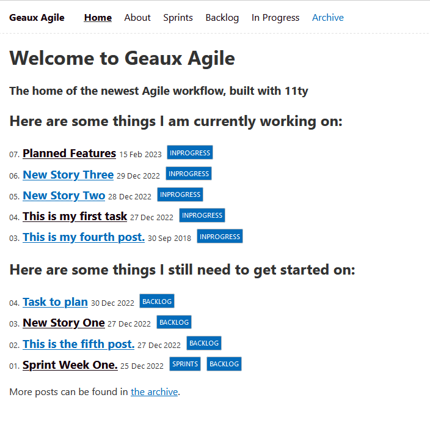

# [GeauxAgile.js](https://geauxagilejs.netlify.app/)

GeauxAgile.js is a work-in-progress, agile framework application that provides a website to plan out and execute weekly sprints and share work in public, somewhat like a digital garden but more structured.

I plan on automating many features on this platform and utilize AI to create service workers that carry out tasks that are planned out in the stories in each weekly sprint.
